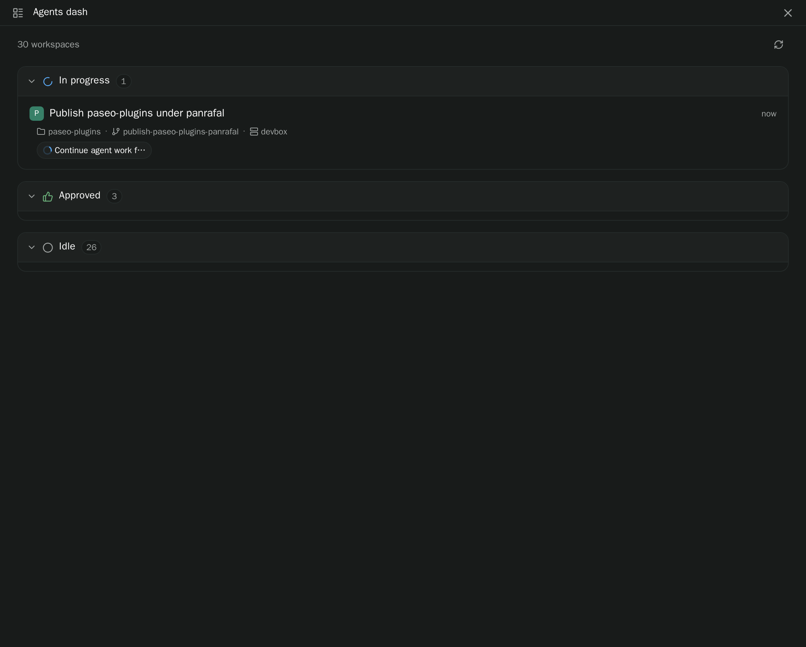
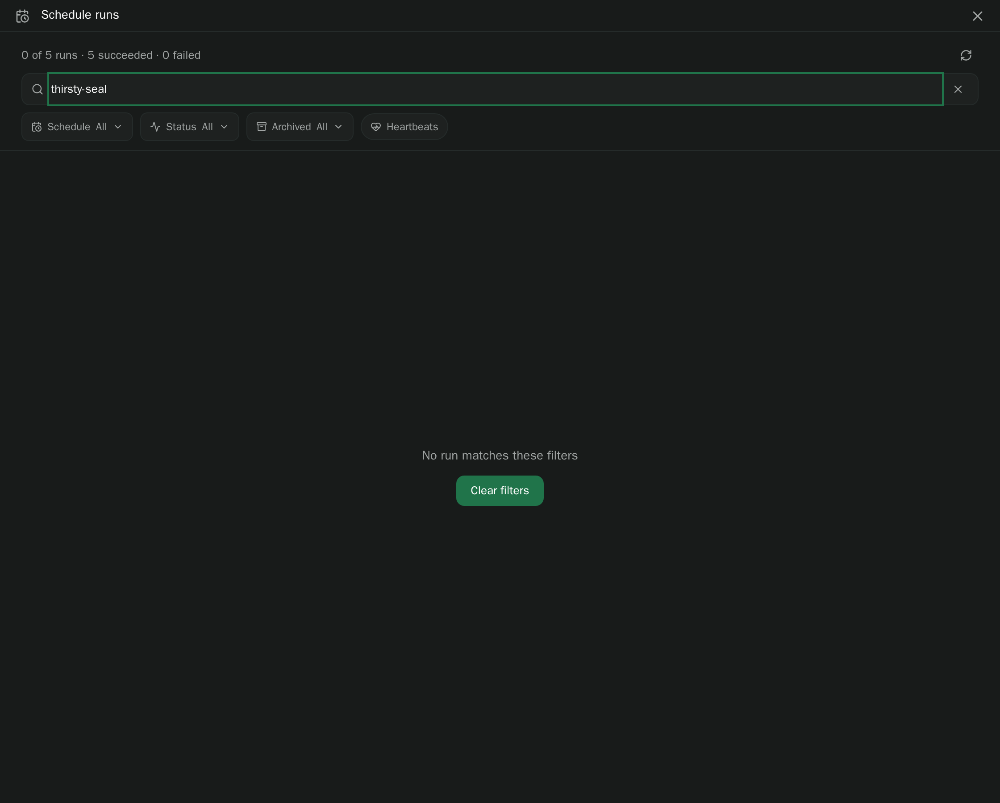
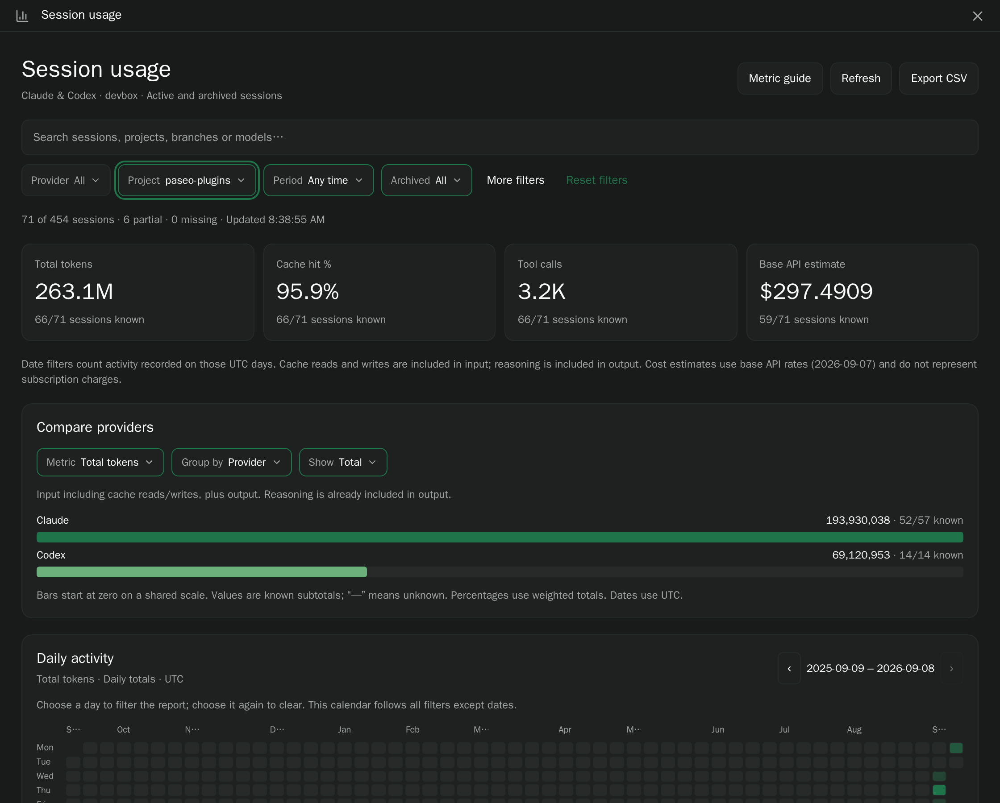
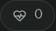
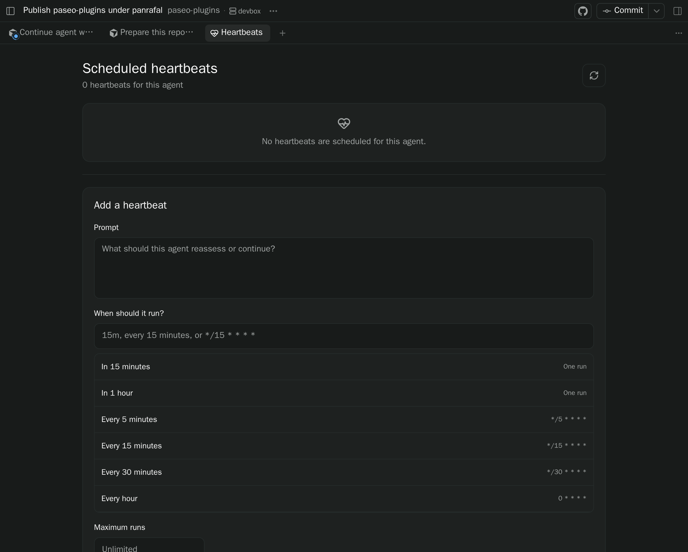
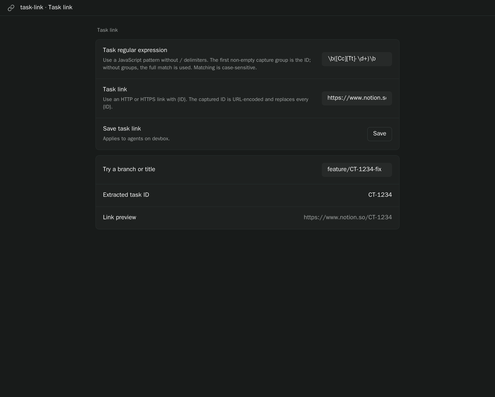
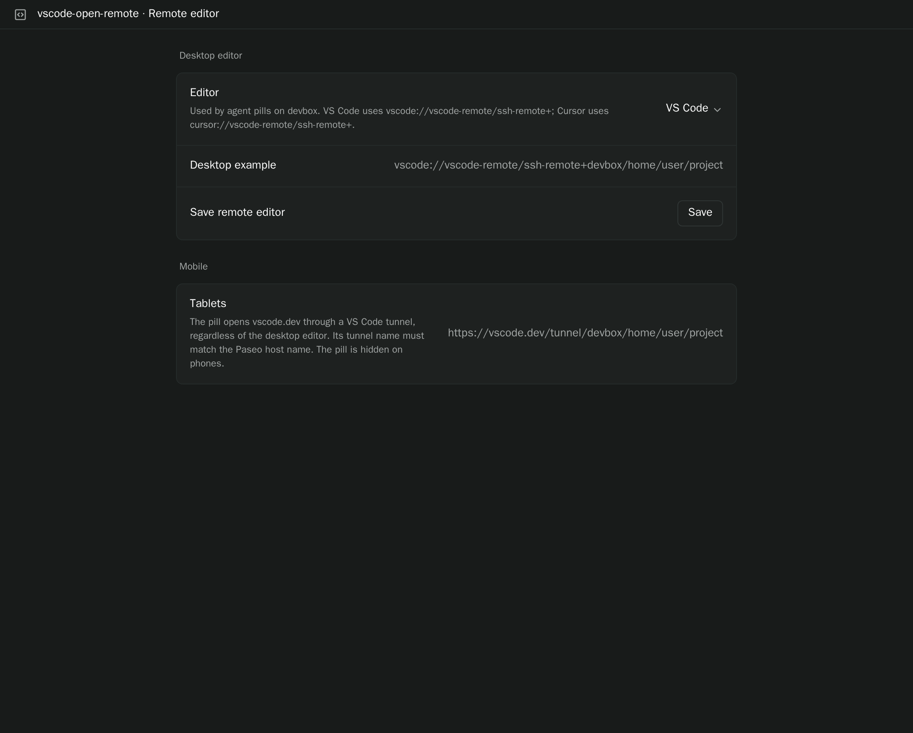

# paseo-plugins

Trusted local [Paseo](https://paseo.sh) plugins for watching agents, searching past chats,
linking tasks, and opening a remote editor. Each directory is its own plugin and installs
independently.

These plugins use the 0.8 plugin SDK. They need **Paseo 0.8 or a current nightly**. Plugins are
trusted, unsandboxed code: the server entry can read files and run commands on the daemon machine,
and the client entry runs inside the Paseo app.

[MIT license](./LICENSE)

## Install

```bash
paseo plugin add panrafal/paseo-plugins:<plugin>
```

From a checkout on the daemon machine:

```bash
paseo plugin install /absolute/path/to/paseo-plugins/<plugin>
```

Then `paseo plugin ls` should show `running`. After source edits: `npm run typecheck` and
`paseo plugin reload <plugin>`.

## Plugins

### Agents dash

[`agents-dash-list`](./agents-dash-list) — a sidebar list of workspaces grouped by what needs you:
waiting, unread, in progress, failing, approved, idle, merged or closed. Archive or mark unread
from the row.



No settings screen. Open **Agents dash** in the sidebar or Command Center. It lists every workspace
on the selected host.

### Agents history

[`agents-history`](./agents-history) — every workspace and agent the daemon has ever had, including
archived ones. Filter by archived state, provider, project, label, and period. Ranked search
indexes on-disk transcripts (names and paths first); regex mode greps instead.


No settings screen. Filters live on the surface. The index is stored under
`$PASEO_HOME/plugin-data`; the plugin does not write daemon or provider state.

### Schedule runs

[`schedule-runs`](./schedule-runs) — one feed of every schedule run: status, workspace, agent,
archived state, and the agent's final response. Filter by schedule, status, archived state, and
keyword.



No settings screen. Reads schedule records on disk; it does not create, pause, or delete
schedules.

### Session usage

[`session-usage`](./session-usage) — Claude and Codex token, cache, cost, and activity stats from
local transcripts, including archived sessions and subagents. Sortable table, provider charts,
calendar, and CSV export.



No settings screen. Filter the report by provider, project, workspace, and date on the surface.
Reads local files only.

### Agent heartbeats

[`agent-heartbeats`](./agent-heartbeats) — a composer pill with the heartbeat count. Press it for a
panel that lists, creates, edits, and deletes that agent's heartbeats. Schedules accept cron, delays
such as `15m`, and phrases such as `every 15 minutes`.




No settings screen. The pill is per agent; the panel is an agent tab.

### Task link

[`task-link`](./task-link) — a composer pill when the agent's branch, title, or workspace name
matches a regular expression. Press the pill to open the configured HTTP(S) link.



Configure under **Settings → Plugins → task-link → Task link**, or **Configure task link** in the
Command Center:

- **Task regular expression** — JavaScript pattern without `/` delimiters. The first non-empty
  capture group is the ID.
- **Task link** — HTTP(S) URL containing `{ID}`.

The shipped default matches `CT-1234` style IDs and opens Notion. Change both to match your tracker
before using the pill. Settings are stored under `$PASEO_HOME/plugin-data/task-link/settings.json`.

### Remote editor

[`vscode-open-remote`](./vscode-open-remote) — a composer **Editor** pill that opens the agent's
working directory in VS Code, Cursor, or a custom URI. Hidden on phones; tablets open vscode.dev
through a tunnel named after the Paseo host.




Configure under **Settings → Plugins → vscode-open-remote → Remote editor**, or **Configure remote
editor** in the Command Center. Settings live under
`$PASEO_HOME/plugin-data/vscode-open-remote/settings.json`.

### Chat resume

[`chat-resume`](./chat-resume) — pills on quota-exhausted agents: continue now if the allowance
has already renewed, schedule one resume after renewal, or prepare an editable handover to
Claude, Codex, Cursor, or another ready provider **in the same workspace**.

No settings screen, and no screenshot here: the pills appear when the latest idle or error
state is a usage-limit / quota exhaustion, including when you reopen the thread later. The
handover draft is an agent panel; the new agent does not start until **Start agent** is pressed.

## Development

```bash
npm install
npm run typecheck
```

Each plugin has its own README for behavior, storage paths, and reload steps. `AGENTS.md` is the
agent-facing guide; `CLAUDE.md` points at it.
