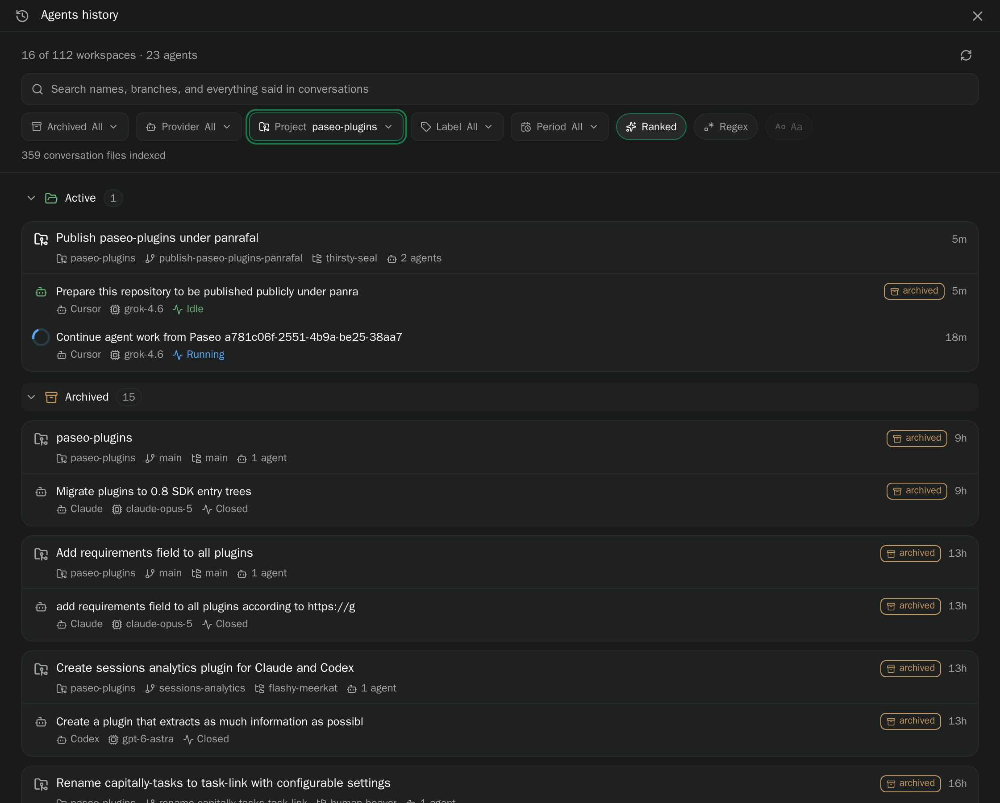

# agents-history

Paseo plugin that adds an **Agents history** entry to the app sidebar. It lists every workspace
the selected daemon has ever had, archived ones included, with the agents that ran in each, and
searches what was said in those conversations through a ranked full-text index of the providers'
transcript files on the daemon host (or `grep`, for regular expressions).

Paseo's own History screen searches agent titles and hides archived workspaces; this surface is
for finding the workspace where something was discussed weeks ago.



## What is listed

Every workspace in the daemon's registry, newest activity first, grouped into **Active** and
**Archived** when the archived filter is set to all. Each card carries:

1. **Head** — the workspace title (its name when it has no title), an amber `archived` badge
   when the workspace or its project is archived, and how long ago anything in it last moved.
   Below, each with a small icon: project, branch, worktree name, agent count, and labels. Pressing the head opens
   the workspace; for an archived one Paseo shows its recovery screen and offers to unarchive.
2. **Agent rows** — one per agent, archived ones included: a status glyph (a spinner while
   running), the title, an `archived` badge, the last activity, and under it, each with a small
   icon, provider, model, and last status.
   Pressing a row opens the agent.

Agents whose workspace record no longer exists are grouped under a "Workspace record missing"
card so they stay reachable.

The header sums what is showing: how many workspaces and agents, and, with filters on, out of how
many.

## Search

Typing in the search box does two things:

- **Immediately**, the list narrows to workspaces whose name, title, branch, directory, project,
  labels, or agent titles contain the text.
- **After a short pause** (or on Enter), the daemon searches every conversation of the agents that
  pass the other filters and the list is reordered: workspaces with the best match first, and
  inside each, the best-matching agents first. Under a matching agent up to three lines appear:
  who said it (`you` or `agent`), the text around the match, and the match itself in bold.
  "+ N more matching lines" means more exist than are shown.

**Ranked** (the default) answers from the search index. Every word must occur, in any order and
any form (`schedule` finds `scheduled`, `heartbeat` finds `heartbeats`); the last word may be a
prefix so results fill in while typing. When no conversation has every word, any word is accepted
and the note under the filters says so. Names count more than what was said: a hit in an agent
title, workspace name, branch, project, label, directory segment, model, or provider is weighted
above hits in the conversation text, and such agents show "matches workspace name, branch" above
their snippets. Letter case is ignored, so **Aa** is muted.

**Regex** treats the text as an extended regular expression and runs `grep -E` over the raw
transcript files instead; **Aa** then makes it case-sensitive. Grep also answers when the index
has not been built yet (the note says so) or when the daemon's Node.js has no SQLite with FTS5.
Grep hits are listed in file order, not ranked, and also cover tool output and provider
bookkeeping (`tool` and `meta` lines), which the index leaves out.

A line under the filters says how many conversations matched across how many agents, how many
agents could not be searched or are not indexed yet, and whether the search was cut short. An
invalid regular expression is reported there as well. A second line shows the state of the index.

## Filters

- **Archived** — all, active only, or archived only. A workspace counts as archived when it or
  its project is.
- **Provider** — pick any number of providers, with agent counts; a workspace stays listed when
  at least one of its agents matches, and only those agents are shown.
- **Project** — pick any number of projects, with workspace counts.
- **Label** — pick any number of workspace labels, with workspace counts; a workspace needs at
  least one of them.
- **Period** — last 24 hours, 7, 30, or 90 days, or any time, on the latest activity of the
  workspace or any of its agents.

On a desktop-sized window the dropdowns open as popovers under their trigger; on a phone they
open in Paseo's sheet.

The search text and filter choices are kept while you navigate around the app, so opening a
workspace you found and coming back shows the same results; they reset when the app restarts.

## Where the history comes from

Paseo does not store conversations itself; it replays the provider's own transcript. The plugin
searches those files directly:

| Provider          | File                                                                                                  |
| ----------------- | ----------------------------------------------------------------------------------------------------- |
| Claude Code       | `~/.claude/projects/<encoded cwd>/<session id>.jsonl` plus the subagent files under `<session id>/subagents/` (`CLAUDE_CONFIG_DIR` respected) |
| Codex             | `~/.codex/sessions/<date>/rollout-*-<thread id>.jsonl`, or `~/.codex/archived_sessions/` once the agent is archived (`CODEX_HOME` respected) |
| OMP, Pi           | the session file the daemon recorded as the agent's native handle                                     |
| Cursor, Kilo, Copilot, other ACP providers | nothing on disk; these agents are listed but say "keeps no conversation file to search" during a search |

## How it works

- The plugin SDK lists only live workspaces, so the server entry reads the daemon's own records:
  `$PASEO_HOME/projects/workspaces.json`, `projects.json`, and one JSON file per agent under
  `$PASEO_HOME/agents`. Files are re-parsed only when their size or modification time changes;
  the client re-reads the census every 30 seconds. Agent records also hold provider credentials;
  the server never returns or logs those fields.
- Typing is debounced by 400 ms; a newer search cancels the one still running; at most two run
  at once; a grep search is cut short after 20 seconds.
- Everything is scoped to the host you are viewing; switching hosts reloads the census.

### Search index

- The index is one SQLite file, `$PASEO_HOME/plugin-data/agents-history/search.sqlite`, using
  Node's built-in `node:sqlite` and its FTS5 extension (present in Node 24 and in Node 22.16 or
  later). Nothing is installed. It holds one row per user or assistant message (`chunks`) and one
  row of metadata per agent (`agent_meta`: title, workspace, project, branch, labels, paths,
  model, provider), both with the porter stemmer.
- It is built the first time the surface is opened and brought up to date every time the surface
  refreshes its census (every 30 seconds while open) or a ranked search finds it stale, at most
  once per 15 seconds. Nothing runs while the surface is closed, and nothing watches the files.
- Transcripts are append-only, so each file remembers how many bytes were consumed and a later
  sync reads only what was added; a file that shrank or was replaced is re-read from the start.
  Work happens in small batches, each its own transaction, with the event loop released in
  between, so searches answer while indexing runs and a plugin reload stops it within a batch.
  Files, agents, and messages that disappear are pruned.
- A search runs two FTS5 queries: one over the messages (every word required, prefix on the last
  one; relaxed to any word when nothing matched) and one over the agent metadata with per-column
  weights (title 6, workspace 5, project, branch, and labels 4, path 2, model and provider 1.5).
  An agent's score is five times its metadata score plus its best message score plus a share of
  its next four. Snippets come from FTS5's `snippet()`.
- A Node.js without `node:sqlite` or without FTS5 leaves every search on grep; the note under the
  filters says so.

## Limitations

- Only providers that keep a transcript file on disk are searchable (see the table above).
- Conversation files that have been deleted, or a Claude session directory Paseo cannot map to
  the agent's directory, make that agent "not searchable"; the census still lists it.
- The index holds what people and agents said. Tool input and output, injected context, and
  provider bookkeeping are not indexed; use **Regex** to grep those.
- Ranked search folds case and stems words with the English porter stemmer; it does not match
  inside words (`beat` does not find `heartbeat`) and cannot take a regular expression.
- A transcript's last line is indexed once its newline is written; a message still being
  streamed appears after the next sync.
- `grep -i` folds case according to the daemon's locale. A grep hit inside a very long line (a
  large tool result) shows a snippet cut from the first megabyte of that line. `grep` returns
  the first hits in file order, and a query that also appears in a record's fields (a branch
  name, a directory, a session id) matches every line of that transcript; such hits are labelled
  `meta` and shown only when nothing said in the conversation matched.
- The plugin never archives, unarchives, or deletes anything. Its only writes are its own index
  file, which can be deleted at any time and is rebuilt on the next open.

## Install

```bash
paseo plugin add panrafal/paseo-plugins:agents-history
```

From a checkout:

```bash
npm install            # from the monorepo root
npm run typecheck
paseo plugin install /absolute/path/to/paseo-plugins/agents-history
paseo plugin ls        # expect "running"
```

After editing:

```bash
npm run typecheck
paseo plugin reload agents-history
paseo plugin logs agents-history   # "search index at …" and "index sync" lines once the surface is opened
```
