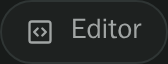

# vscode-open-remote

Paseo plugin that adds an **Editor** composer pill to every active agent on the daemon where
the plugin is installed. Pressing it opens the agent's current working directory — the project
directory or its worktree — through the Paseo host name.




Desktop links use one of these prefixes:

| Editor | URL |
| --- | --- |
| VS Code (default) | `vscode://vscode-remote/ssh-remote+<host><cwd>` |
| Cursor | `cursor://vscode-remote/ssh-remote+<host><cwd>` |
| Custom | `<configured-prefix><host><cwd>` |

Open **Settings → Plugins → vscode-open-remote → Remote editor** to select VS Code, Cursor,
or an arbitrary URI prefix. **Configure remote editor** in the Command Center opens the same
native settings screen (requires Paseo’s `addSettingsScreen`, `openSettings`, and
`@getpaseo/plugin/client/ui` APIs). The setting is stored under
`$PASEO_HOME/plugin-data/vscode-open-remote/settings.json` on that daemon and shared by its clients.
Existing saved choices are preserved.
Paseo owns the settings navigation, scrolling, responsive layout, and theme.

Paseo's native opener only accepts HTTP(S), so desktop editor protocols use a short-lived protocol
window. The plugin closes it automatically after handing the URL to VS Code, Cursor, or the chosen
custom editor.

The pill is hidden on phones (mobile devices whose shortest screen side is under 600 logical
pixels). On tablets, it instead opens:

```text
https://vscode.dev/tunnel/<host><cwd>
```

VS Code for the Web cannot connect over Remote SSH. A [VS Code Remote Tunnel](https://code.visualstudio.com/docs/remote/tunnels)
must already be running on the daemon machine, and its tunnel name must match the host name configured
in Paseo.

## Install

Install this plugin on each **remote** Paseo daemon whose agents should get the pill. Plugin
contributions are daemon-scoped; the current Paseo plugin API does not expose whether an installation
is local to a particular client, so installing it on a local daemon will also add pills there.

```bash
paseo plugin add panrafal/paseo-plugins:vscode-open-remote
```

From a checkout:

```bash
npm install
npm run typecheck
paseo plugin install /absolute/path/to/paseo-plugins/vscode-open-remote
paseo plugin ls
```

After editing:

```bash
npm run typecheck
paseo plugin reload vscode-open-remote
paseo plugin logs vscode-open-remote
```

The desktop machine needs VS Code's Remote - SSH extension or Cursor's Remote SSH support, and the
Paseo host name must resolve through the desktop machine's SSH configuration.
